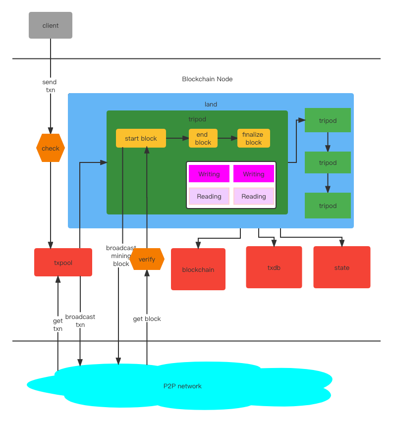

<div align="center">
</img>

---

[](https://github.com/yu-org/yu/blob/main/LICENSE)
[](https://golang.org/)

</div>

# 禹
Yu is a highly customizable blockchain framework.  

[Book](https://yu-org.github.io/yu-docs/en/)  
[中文文档](https://yu-org.github.io/yu-docs/zh/)

## 🏢 Enterprise Users

### 🌟 **Reddio**
*Blockchain Infrastructure Provider*
- [Official Website](https://reddio.com/) | [Twitter](https://twitter.com/reddio_com)
- Built a high-performance, scalable L2 blockchain solutions with Yu framework

### 🔬 **AWresearch** 
*Web3 Game platform chain*
- [Official Website](https://awresearch.io/) | [Twitter](https://twitter.com/awresearch)
- Built a gaming platform blockchain using Yu framework

### Overall Structure


### Usage 
```go
type Example struct {
    *tripod.Tripod
}

// Here is a custom development of an Writing
func (e *Example) Write(ctx *context.WriteContext) error {
    caller := ctx.GetCaller()
    // set this Writing lei cost
    ctx.SetLei(100)
    // Store data in on-chain state.
    e.Set([]byte("1"), []byte("yu"))
    // Emit an event.
    ctx.EmitStringEvent(fmt.Printf("execute success, caller: %s", caller.String()))
    return nil
}

// Here is a custom development of a Reading
func (e *Example) Read(ctx *context.ReadContext) {
    key := ctx.GetString("key")
    value, err := e.Get(key.Bytes())
    if err != nil {
        ctx.JsonOk(err)
        return
    }
    ctx.String(string(value))
    return nil
}
```
Then, register your `Writing` and `Reading` and start with `main`.
```go
func NewExample() *Example {
    tri := tripod.NewTripod()
    e := &Example{tri}

    e.SetWritings(e.Write)
    e.SetReadings(e.Read)

    return e
}

func main() {
	yuCfg := startup.InitDefaultKernelConfig()
	poaConf := poa.DefaultCfg(0)
	
	startup.DefaultStartup(yuCfg, poa.NewPoa(poaConf), NewExample())
}
```
Build and Run
```zsh
go build -o yu-example

./yu-example 
 
```

---

## Introduction
By using Yu, you can customize three levels to develop your own blockchain. The `Tripod` is for developers to 
customize their own business.     
First level is define  `Writing` and `Reading` on chain.  
Second level is define `blockchain lifecycle`. ( including customizable Consensus Algorithm )  
Third level is define `basic components`, such as `block data structures`, `blockchain`, `txdb`, `txpool`. 
- Define your `Writing` and `Reading` on  chain.  
`Writing` is `State-Transition`, like `Transaction` in Ethereum but not only for transfer of Token, it changes the state on the chain and must be consensus on all nodes.  
`Reading` is like `query` in Ethereum, it doesn't change state, just query some data from the chain.  
`P2pHandler` is a p2p server handler. You can define the services in P2P server. Just like TCP handler.
```go
type (
    Writing func(ctx *context.WriteContext) error
	
    Reading func(ctx *context.ReadContext)

    P2pHandler func([]byte) ([]byte, error)
)
```

- Define Your `blockchain lifecycle`, this function is in `Tripod` interface.  
`CheckTxn` defines the rules for checking transactions(Writings) before inserting txpool.  
`VerifyBlock` defines the rules for verifying blocks.   
`InitChain` defines business when the blockchain starts up. You should use it to define `Genesis Block`.  
`StartBlock` defines business when a new block starts. In this func, you can set some attributes (including pack txns from txpool, mining) in the block.    
`EndBlock` defines business when all nodes accept the new block, usually we execute the txns of new block and append  block into the chain.  
`FinalizeBlock` defines business when the block is finalized in the chain by all nodes.
 
```go
type Tripod interface {

    ......
    
    CheckTxn(*txn.SignedTxn) error   

    VerifyBlock(block *types.Block) bool

    InitChain(genesisBlock *types.Block) 

    StartBlock(block *types.Block) 

    EndBlock(block *types.Block) 

    FinalizeBlock(block *types.Block) 
}
```

#### Examples

[Asset Tripod](https://github.com/yu-org/yu/blob/master/apps/asset)  
`Asset Tripod` imitates an Asset function, it has `transfer accounts`, `create accounts`.  
`QueryBalance` queries someone's account balance. It implements type func `Reading`.
```go
func (a *Asset) QueryBalance(ctx *context.ReadContext) error {
    account := ctx.GetAddress("account")
    if !a.existAccount(account) {
        return nil, AccountNotFound(account)
    }
    amount := a.getBalance(account)
    return ctx.Json(context.H{"amount": amount})
}
```  
`CreateAccount` creates an account. It implements type func `Writing`.  
`EmitStringEvent` will emit a string event out of the chain.  
The error returned will emit out of the chain.
```go
func (a *Asset) CreateAccount(ctx *context.WriteContext) error {
    ctx.SetLei(100)
    addr := ctx.Caller
    amount := big.NewInt(int64(ctx.GetUint64("amount")))

    if a.existAccount(addr) {
        ctx.EmitStringEvent("Account Exists!")
        return nil
    }

    a.setBalance(addr, amount)
    ctx.EmitStringEvent("Account Created Success!")
    return nil
}
```  

We need use `SetExec` and `SetQueries` to set `Writing` and `Reading` into `Asset Tripod`.  
When we set a `Writing`, we need declare how much `Lei`(耜) it consumes. (`Lei` is the same as `gas` in `ethereum` )
```go
func NewAsset(tokenName string) *Asset {
    df := NewDefaultTripod("asset")

    a := &Asset{df, tokenName}
    a.SetWritings(a.Transfer, a.CreateAccount)
    a.SetReadings(a.QueryBalance)

    return a
}
```

[Poa Tripod](https://github.com/yu-org/yu/blob/master/apps/poa/poa.go)    
**Consensus Tripod is necessary for a blockchain, so you have to choose one consensus algorithm at least.**  
`Poa Tripod` implements a Proof of Authority consensus algorithm. For detailed implementation and usage information, see the [PoA README](apps/poa/README.md).  

Finally set `Asset Tripod`, `Poa Tripod` into `land` in `main function`.    
```go
func main() {
    startup.InitConfigFromPath("yu_conf/kernel.toml")
    startup.DefaultStartup(
        poa.NewPoa(poaConf),
        asset.NewAsset("YuCoin"),
    )
}
```

