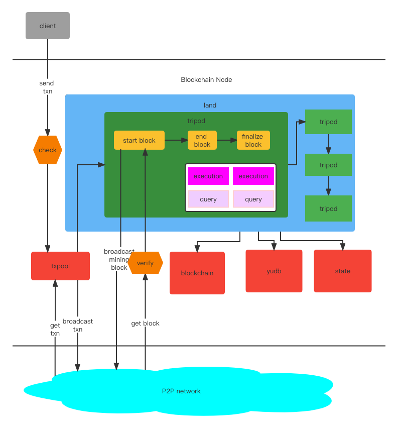

# 禹

Yu is a highly customizable blockchain framework.

### Overall Structure


## Introduction
By using Yu, you can customize three levels to develop your own blockchain. The `Tripod` is for developers to 
customize their own bussiness.     
First level is define  `Exection` and `Query` on chain.  
Second level is define `blockchain lifecycle`. ( including customizable Consensus Algorithm )  
Third level is define `basic components`, such as `block data structures`, `blockchain`, `blockbase`, `txpool`. 
- Define your `Exection` and `Query` on  chain.  
`Execution` is like `Transaction` in Ethereum but not only for transfer of Token, it changes the state on the chain and must be consensus on all nodes.  
`Query` is like `query` in Ethereum, it doesn't change state, just query some data from the chain.  

```
type (
	Execution func(*context.Context, *chain_env.ChainEnv) error
	
	Query func(*context.Context, *chain_env.ChainEnv, common.Hash) (respObj interface{}, err error)
)
```
- Define Your `blockchain lifecycle`, this function is in `Tripod` interface.  
`CheckTxn` defines the rules for checking transactions(Executions) before inserting txpool.  
`VerifyBlock` defines the rules for verifying blocks.   
`InitChain` defines bussiness when the blockchain starts up. You should use it to define `Genesis Block`.  
`StartBlock` defines bussiness when a new block starts. In this func, you can set some attributes( including package txns from txpool, mining ) in the block,
then you should tell the framework whether broadcast the block to other nodes or not.    
`EndBlock` defines bussiness when all nodes accept the new block, usually we execute the txns of new block and append  block into the chain.  
`FinalizeBlock` defines bussiness when the block is finalized in the chain by all nodes.
 
```
type Tripod interface {

    ......
    
    CheckTxn(*txn.SignedTxn)    

    VerifyBlock(block IBlock, env *ChainEnv) bool

    InitChain(env *ChainEnv, land *Land) error

    StartBlock(block IBlock, env *ChainEnv, land *Land) (needBroadcast bool, err error)

    EndBlock(block IBlock, env *ChainEnv, land *Land) error

    FinalizeBlock(block IBlock, env *ChainEnv, land *Land) error
}
```

#### Examples

[Asset Tripod](https://github.com/Lawliet-Chan/yu/blob/master/apps/asset)  
`Asset Tripod` imitates an Asset function, it has `transfer accounts`, `create accounts`.  
`QueryBalance` queries someone's account balance. It implements type func `Query`.
```
func (a *Asset) QueryBalance(ctx *context.Context, env *ChainEnv, _ Hash) (interface{}, error) {
	account := ctx.GetAddress("account")
	amount := a.getBalance(env, account)
	return amount, nil
}
```  
`CreateAccount` creates an account. It implements type func `Execution`.  
`EmitEvent` will emit an event out of the chain.  
The error returned will emit out of the chain.
```
func (a *Asset) CreateAccount(ctx *context.Context, env *ChainEnv) error {
	addr := ctx.Caller
	amount := ctx.GetUint64("amount")

	if a.exsitAccount(env, addr) {
		_ = ctx.EmitEvent("Account Exists!")
		return nil
	}

	a.setBalance(env, addr, Amount(amount))
	_ = ctx.EmitEvent("Account Created Success!")
	return nil
}
```  

We need use `SetExecs` and `SetQueries` to set `Execution` and `Query` into `Asset Tripod`.
```
func NewAsset(tokenName string) *Asset {
	df := NewDefaultTripod("asset")

	a := &Asset{df, tokenName}
	a.SetExecs(a.Transfer, a.CreateAccount)
	a.SetQueries(a.QueryBalance)

	return a
}
```  
Finally set `Asset Tripod` into `land` in `main func`. 
```
func main() {
    startup.StartUp(pow.NewPow(1024), asset.NewAsset("YuCoin"))
}
```

[Pow Tripod](https://github.com/Lawliet-Chan/yu/blob/master/apps/pow/pow.go)  
`Pow Tripod` imitates a Consensus algorithm for proof of work. It customizes the lower-level code.
- Start a new block  
If there are no verified blocks from P2P network, we pack some txns, mine a new block and broadcast it to P2P network.
```
func (p *Pow) StartBlock(block IBlock, env *ChainEnv, _ *Land) (needBroadcast bool, err error) {
    ......

    // get validated blocks from P2P network, if exists, use it and return.
    pbsht, err := chain.TakeP2pBlocks(height)
    if err != nil {
   	logrus.Errorf("get p2p-blocks error: %s", err.Error())
    }
    if len(pbsht) > 0 {
   	block.CopyFrom(pbsht[0])
   	logrus.Infof("USE P2P block(%s)", block.GetHash().String())
   	env.StartBlock(block.GetHash())
   	return
    }
    
    // if there are no validated blocks from P2P network, we need to mine a block.
    needBroadcast = true

    ......

    // pack transactions(Executions) from txpool
    txns, err := pool.Pack("", p.pkgTxnsLimit)
    if err != nil {
    	return
    }

    ......

    // mine a hash for the new block
    nonce, hash, err := spow.Run(block, p.target, p.targetBits)
    if err != nil {
        return
    }

    block.(*Block).SetNonce(uint64(nonce))
    block.SetHash(hash)

    ......

    return 
}
```
- End the block  
We execute the txns of the block and append the block into the chain.
```
func (*Pow) EndBlock(block IBlock, env *ChainEnv, land *Land) error {
        ......

        // execute the txns of the block
	err := node.ExecuteTxns(block, env, land)
	if err != nil {
		return err
	}

        // append the block into chain
	err = chain.AppendBlock(block)
	if err != nil {
		return err
	}

        ......
        // flush the txpool to prepare for new txns of the next block   
        return pool.Flush()   
}
```

- Finalize the block  
poW does not need `finalize` stage, so the `FinalizeBlock` has no implements.  


Same as `Asset Tripod` , finally set `Pow Tripod` into `land` in `main function`.    
```
func main() {
	startup.StartUp(pow.NewPow(1024), asset.NewAsset("YuCoin"))
}
```

